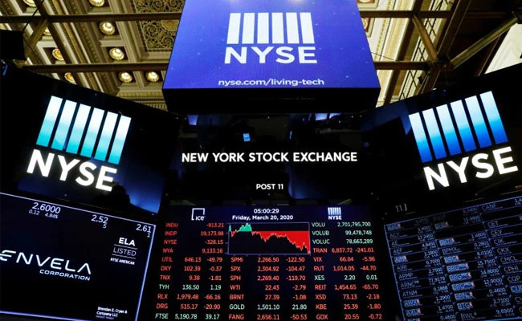

# New-York-Stock-Exchange-Prediction-

## AIM:
- To train a model to get the prediction of "New York Stock Exchange" with respect to time further ahead
- We here has the value of 2016 whole year 
- 80% of which value will be trained to valid with rest data
- and with this training we get model that will predict the further values

## About:
Dataset consists of following files:
- 1. prices.csv: raw, as-is daily prices. Most of data spans from 2010 to the end 2016, for companies new on stock market date range is shorter. There have been approx. 140 stock splits in that time, this set doesn't account for that.
- 2. prices-split-adjusted.csv: same as prices, but there have been added adjustments for splits.
- 3. securities.csv: general description of each company with division on sectors
- 4. fundamentals.csv: metrics extracted from annual SEC 10K fillings (2012-2016), should be enough to derive most of popular fundamental indicators.
